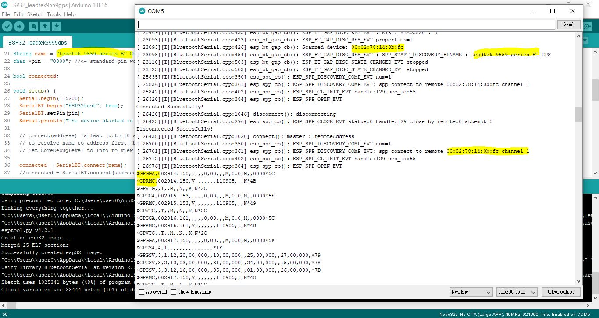
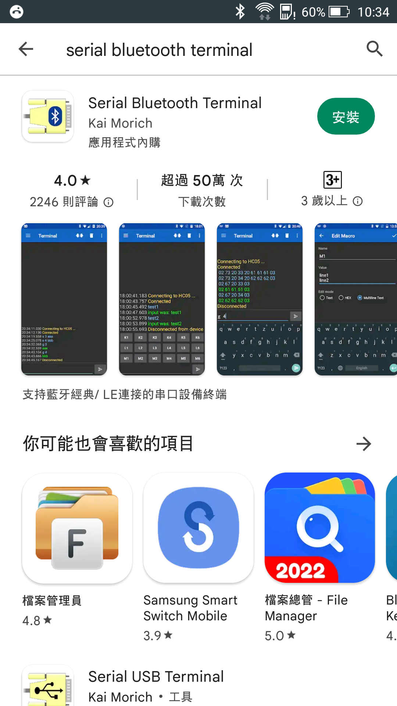

# GPS_leadtek_9559X_ESP32
old GPS bluetooth device, serial output 19200 baud N81, NMEA-0183 or SiRF bainary  

very old device, year 2005 used since, but still working great

### full working source code
[ESP32_leadtek9559gps](ESP32_leadtek9559gps)  
  


### NMEA message log
```
$GPGSV,3,1,12,20,00,000,,10,00,000,,25,00,000,,27,00,000,*79
$GPGSV,3,2,12,03,00,000,,31,00,000,,24,00,000,,15,00,000,*78
$GPGSV,3,3,12,16,00,000,,05,00,000,,01,00,000,,26,00,000,*7D
$GPRMC,004322.213,V,,,,,,,110905,,,N*46
$GPVTG,,T,,M,,N,,K,N*2C
$GPGGA,004323.205,,,,,0,00,,,M,0.0,M,,0000*57
$GPRMC,004323.205,V,,,,,,,110905,,,N*40
$GPVTG,,T,,M,,N,,K,N*2C
$GPGGA,004324.207,,,,,0,00,,,M,0.0,M,,0000*52
$GPRMC,004324.207,V,,,,,,,110905,,,N*45
$GPVTG,,T,,M,,N,,K,N*2C
$GPGGA,004325.213,,,,,0,00,,,M,0.0,M,,0000*56
$GPRMC,004325.213,V,,,,,,,110905,,,N*41
$GPVTG,,T,,M,,N,,K,N*2C
$GPGGA,004326.202,,,,,0,00,,,M,0.0,M,,0000*55
$GPRMC,004326.202,V,,,,,,,110905,,,N*42
$GPVTG,,T,,M,,N,,K,N*2C
$GPGGA,004327.202,,,,,0,00,,,M,0.0,M,,0000*54
$GPGSA,A,1,,,,,,,,,,,,,,,*1E

```
reading,  
https://blog.csdn.net/qq_16064871/article/details/52823591  
$GPRMC：Recommended Minimum Specific GPS/TRANSIT Data－RMC，推荐定位信息1次/1秒  
$GPGGA：输出GPS的定位信息；Global Positioning System Fix Data－GGA，GPS定位信息, 输出1次/1秒  
$GPGLL：输出大地坐标信息；
$GPVTG : Track Made Good and Ground Speed－VTG，地面速度信息  
$GPZDA：输出UTC时间和日期信息  
$GPGSV：输出可见的卫星信息；GPS Satellites in View－GSV，可见卫星信息，1次/5秒）  
$GPGST：输出定位标准差信息；GPS 伪距噪声统计,包括了三维坐标的标准偏差信息）  
$GPGSA：输出卫星DOP值信息；GPS DOP and Active Satellites－GSA，当前卫星信息，1次/1秒  
$GPALM：输出卫星星历信息；  


### set SiRF device, Switch to SiRF binary protocol, Message ID 100  
with serial baud rate, N81  
(SiRF was CSR and then beccome Qualcomm today)  
```
//char gpsMessage[]= "$PSRF100,0,9600,8,1,0*0C";	// SiRF set baud rate 9600, N81
//char gpsMessage[]= "$PSRF100,0,19200,8,1,0*39";	// SiRF set baud rate 19200, N81
//char gpsMessage[]= "$PSRF100,0,38400,8,1,0*3C";	// SiRF set baud rate 38400, N81
//char gpsMessage[]= "$PSRF100,0,57600,8,1,0*37";	// SiRF set baud rate 57600, N81
//char gpsMessage[]= "$PSRF100,0,115200,8,1,0*04";	// SiRF set baud rate 115200, N81

```


### set SiRF device, Switch To NMEA Protocol – Message ID 129  
Switches a serial port from binary to NMEA protocol and sets message output rates and bit rate on the port.  
Table 2-8 contains the input values for the following example:  
Request the following NMEA data at 9600 bits per second:  
GGA – ON at 1 sec, GLL – OFF, GSA – ON at 1sec,  
GSV – ON at 5 sec, RMC – ON at 1sec, VTG-OFF, MSS – OFF, ZDA-OFF.  
Example:  
A0A20018—Start Sequence and Payload Length  
810201010001010105010101000100010001000100012580—Payload  
013AB0B3—Message Checksum and End Sequence  


### NMEA-0183 Standard For Interfacing Marine Electronic Devices.
the message and checksum, example,  
```
"$PSRF100,0,9600,8,1,0*0C"
```
0C is CHECKSUM, 0x0C is a two-hex character checksum. Checksum consists of a binary exclusive OR the lower 7 bits of each character after the “$” and before the “*” symbols. The resulting 7-bit binary number is displayed as the ASCII equivalent of two hexadecimal characters representing the contents of the checksum. Use of checksums is required on all NMEA messages.  
my little tool for expewriment, [gps_nmea_string_checksum](gps_nmea_string_checksum), compiled with MinGW.


Compliant Bluetooth specification v1.2, Series Port Profile (SPP)

### Bluetooth connection pin#, default 0000

### testing with win10 first, PDA was no longer supported
dowanload app bluetooth serial terminal, https://apps.microsoft.com/store/detail/bluetooth-serial-terminal/9WZDNCRDFST8?hl=en-au&gl=au  

  

### stand alone testing, LED status,
  


### my device, LED_1 and LED_2 is swapped  
does not match the user manual, perhaps errata, Leadtek was no longer produces GPS product in year 2022.  


### online NMEA data analyser  
https://swairlearn.bluecover.pt/nmea_analyser  

大神做的小工具 https://github.com/xiaolaba/nmea_gprmc, NMEA 資料轉化成 GPX, 大神沒有教如何編譯, exe 在 win10 也不能動.  
叉了, 沒有直接用, 另外改, 純粹方便編譯, 做了小修改, 自己做了一個 bat, 放在這裡, minGW 編譯, 能用  
如何編譯, 用 minGW, 進入 [nmea_gprmc_gpx/xiao_biuld_script](nmea_gprmc_gpx/xiao_biuld_script)  
自己加入 GPS 的 NMEA 紀錄, 存檔到 nmea.txt
執行 compile.bat 後, 會產生3個檔案,   
gprmc.exe  
nmea_parse.txt  
nmea_parse.txt.gpx  

把 nmea_parse.txt.gpx 餵給 openstreet map, google erath 之類, 就可看到軌跡.  

改過的源碼在 [nmea_gprmc_gpx/nmea_gprmc/src](nmea_gprmc_gpx/nmea_gprmc/src),  
txt2gpx.cpp    
main.cpp  

編譯用的 BAT, [nmea_gprmc_gpx/xiao_biuld_script/compile.bat](nmea_gprmc_gpx/xiao_biuld_script/compile.bat)  
  
要看大神的原始碼, 看那個叉 https://github.com/xiaolaba/nmea_gprmc  


### 現用 LEADTEK 9559X, 用藍芽連接, SiRF III 的老產品, 大約 4000mAh 電池可以用35小時.
COM3 / TTY3 寫入, COM4 / TTY4 讀取,
不適合飛行時使用,
只適合地面開車使用.

實際用其他產品比對過,
iphone13 pro 的 gps 即使在民航機機艙內也可收訊, 定位速度大約40秒, 除了穿越對流層有雲層遮蓋時候斷訊, 用 mapsme 測試.
iphone11 pro 的 gps 即使機艙內完全斷訊, 無法定位, 用 mapsme 測試.
ANDROID 9 的機器, gps 在機艙也完全無能, 有可能是 broadcom 的舊芯片方案.
iphone 無法查得到 GPS 芯片用甚麼.


### Android test rig setup & log  
  
https://play.google.com/store/apps/details?id=de.kai_morich.serial_bluetooth_terminal&hl=en_US&gl=US&pli=1  
tested phones,  
android 5.0.2, HTC 8088  
android 9, nokia TA-1052  


### LEADTEK 9559X, specification,

```
Specifications
Chipset : GSW3 SiRFStarIII technology

SiRF GSW3
Protocol : NMEA-0183 (default) / SiRF Binary
Baud rate : 19200bps (default)

Datum WGS-84 (default) / User configurable
Protocol message Default: GGA (1sec), GSA(5sec), GSV(5sec), RMC(1sec), VTG(1sec)

General
Frequency : L1, 1575.42MHz
C/A code : 1.023 MHz chip rate
Channels : 20

Accuracy
Position : 10 meters, 2D RMS
           5 meters 2D RMS, WAAS corrected
           < 5 meters (50%), DGPS corrected
Velocity : 0.1 m/s
Time :     1 microsecond synchronized to GSP time

Time to first fix (Open sky and stationary)
Reacquisition : 0.1 sec. average
Hot start : 8 sec. average typical TTFF
Warm start : 38 sec. average typical TTFF
Cold start : 42 sec. average typical TTFF

Power
Main power input 5 ± 5%(10%)V DC input Power
consumption ~390 mW(continuous mode)
Backup power 1.5 ± 10%V DC input
Operation Time 11 hours (1000mAh Li-Ion battery)

Time 1pps pulse
Level 3.3V TTL
Pulse duration 1 μs
Time reference At the pulse’s positive edge
Measurements Aligned to GPS second, ±1 microsecond
Interface
Power recharge Mini-USB connector

Connector for
external antenna
GPS communications
interface
Bluetooth
MMCX
TTTL level serial

Bluetooth
MMCX
TTTL level serial port
Frequency 2400MHz to 2483.5zMHz
Modulation Method GFSK, 1Mbps, 0.5BT Gaussian
Maximum Data Rate Asynchronous: 723.2kbps/57.6kbps
Synchronous: 433.9kbps/433.9kbps
Transmission Power
(Maximum)
4dBm (Class2)
Hoping 1600hops/sec, 1MHz channel space
Receiving Signal
Range
Receiver IF
Frequency
Baseband Crystal
OSC
-84 to -15dBm
1.5MHz center frequency
16MHz
Compliant Bluetooth specification v1.2
Profile Series Port Profile (SPP)
Bluetooth Operation Range : 10M

LED
LED 1

Color Blue Flashing Blue Red
BT active Yes No -
Low power - - Yes

LED 2
Color Green Flashing Green Orange
GPS fix status No Yes -
Battery charging - - Yes

```


